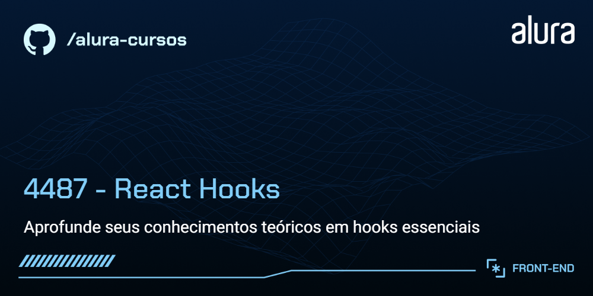

# React Hooks Essenciais

Página do aplicativo Fokus, um aplicativo de gerenciamento de tarefas com temporizador pomodoro embutido. Ótimo para alavancar sua produtividade mantendo a concentração e evitando distrações.

## 🔨 Funcionalidades do Projeto

A página exibirá um cabeçalho, um cronômetro e um texto selecionado. Existem botões para os seguintes modos: **Foco**, **Pausa Curta** e **Pausa Longa**. Ao clicar em um desses botões, o estado global da aplicação será atualizado, alterando também o cronômetro. É possível iniciar e pausar o cronômetro.

## ✔️ Técnicas e Tecnologias Utilizadas

As principais técnicas e tecnologias utilizadas neste projeto são:

- React
- JavaScript
- HTML
- CSS

## 📁 Acesso ao Projeto

Você pode [acessar o protótipo do projeto inicial no Figma acessando aqui](https://www.figma.com/community/file/1486423470267194718).

## 🛠️ Como Abrir e Rodar o Projeto

Após baixar o projeto, você pode abri-lo no Visual Studio Code. Para isso, siga os passos abaixo:

1. No menu superior do VS Code, clique em:
   - **File > Open Folder** (ou uma opção similar)
2. Procure o local onde o projeto foi salvo e selecione a pasta (se o projeto foi baixado como um arquivo ZIP, será necessário extraí-lo antes).
3. Clique em **OK**.
4. Abra o terminal no VS Code.
5. Execute o comando `npm install` para instalar as dependências.
6. Em seguida, execute `npm run dev` para iniciar o projeto.

Após finalizar esses passos, você pode visualizar a aplicação.
